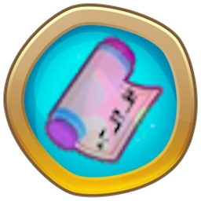

<h1 align="center">Quest++</h1>

### Adds three types of quests in the top right corner: Bloon Pops, Money Earned, and Quests Completed. Finishing a quest rewards you with monkey money.

    

Completed:

* 3 Quests
* Saving
* Sandbox dectection

Yet to Come:

* Prestige
* More Quests
  
<h1 aling="left"></h1>

